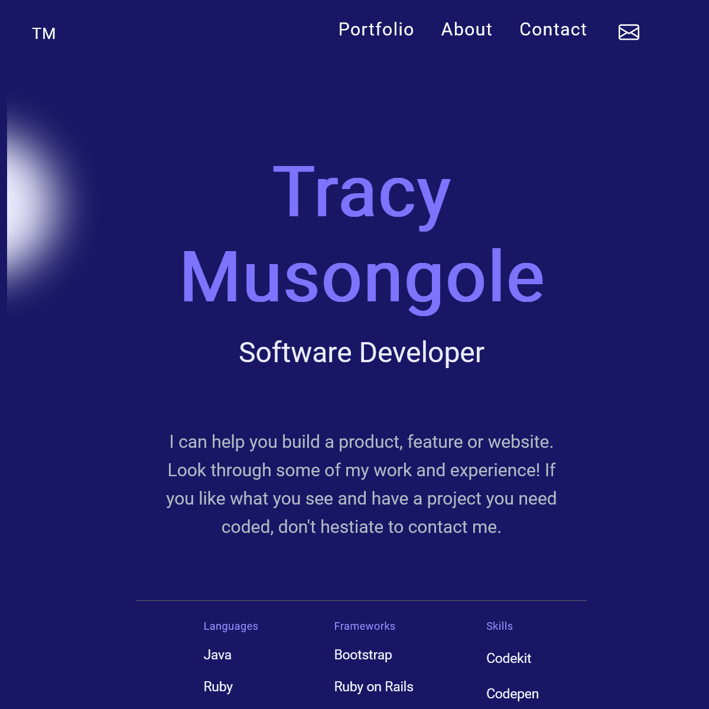
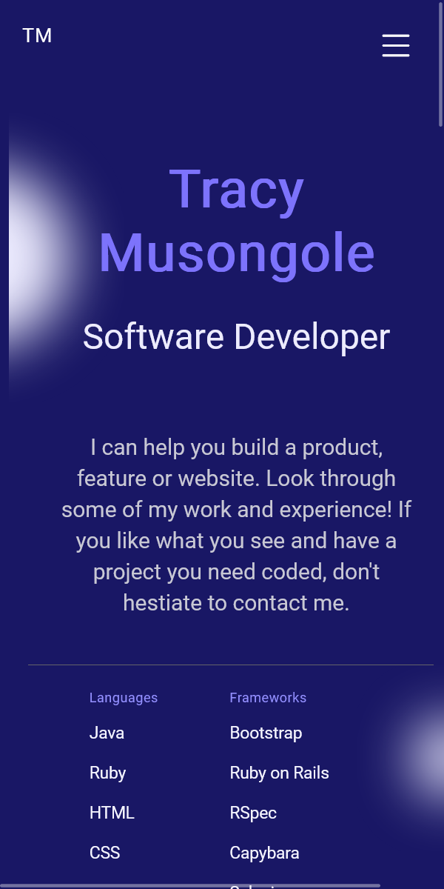

# Thy Portfolio

> This is a skeleton of a professional portfolio. This would best suit a software developer. The main features are the intro section, the skills section, the project section and the contact section. All projects have live demos. Both mobile and desktop version are available.

.

## Built With

- HTML & CSS
- Javascript
- Github

## Live Demo 

https://TracyMuso.github.io/Thy-Portfolio/

## Getting Started

**To get a local copy up and running follow these simple example steps.**

# Prerequisites

- Github flow knowledge. -Intermediate CSS, HTML and Javascript. -Installation of linter files. -install webpack

# Setup 
- To clone the repository run [https://github.com/TracyMuso/Thy-Portfolio] in your terminal

# Usage
- This can be used as a software developer portfolio.

# Install
- Set up Github Actions
- Set up linter > Lighthouse , Webhint ,Stylelint , Eslint.

## Authors

👤 **Tracy Musongole**

- GitHub: [@githubhandle](https://github.com/TracyMuso)
- Twitter: [@twitterhandle](https://twitter.com/tracy_muso)
- LinkedIn: [LinkedIn](https://linkedin.com/in/tracy-muso/)

## 🤝 Contributing

Contributions, issues, and feature requests are welcome!

**Shout out to the contributors of this project**

👤 **Momanyi Hassan**

- GitHub: [@fullstop125](https://github.com/fullstop125)
- LinkedIn: [momanyi-hassan](https://linkedin.com/in/momanyi-hassan-32a489180)
- Twitter: [@moseshassany](https://twitter.com/moseshassany)

Feel free to check the [issues page](https://github.com/TracyMuso/Thy-Portfolio/issues).

## Show your support

Give a ⭐️ if you like this project!

## Acknowledgments

- Hat tip to anyone whose code was used
- Inspiration
- etc

## 📝 License

This project is [MIT](./LICENSE) licensed.
